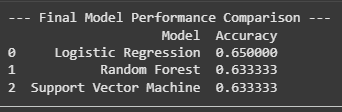

# Heart Disease Prediction using Machine Learning

A mini-project to predict the presence and severity of heart disease using clinical data and multiple classification algorithms.

---

## 📋 Table of Contents
1. [About The Project](#about-the-project)
2. [Project Workflow](#project-workflow)
3. [Built With](#built-with)
4. [Getting Started](#getting-started)
   - [Prerequisites](#prerequisites)
   - [Installation](#installation)
5. [Usage](#usage)
6. [Results](#results)
7. [Conclusion](#conclusion)
8. [Authors](#authors)
9. [Acknowledgments](#acknowledgments)

---

## 📖 About The Project

This project focuses on the application of machine learning to a real-world healthcare problem: the early detection of heart disease. Using the UCI Heart Disease dataset, we developed a system to classify the stage of heart disease in patients based on various clinical attributes.

The primary goal was to evaluate and compare the performance of three different classification models—**Logistic Regression**, **Random Forest**, and **Support Vector Machine (SVM)**—to understand their effectiveness and limitations on this particular medical dataset. A key finding of this project was the significant impact of **class imbalance** on model performance.

---

## 📈 Project Workflow

The project followed a standard machine learning pipeline, from data ingestion to final model evaluation, as shown below.


---

## 🛠️ Built With

This project was built using the following technologies and libraries:

* **Python 3.12**
* **Scikit-learn:** For machine learning models and preprocessing.
* **Pandas:** For data manipulation and analysis.
* **Matplotlib & Seaborn:** For data visualization.
* **Jupyter Notebook / Google Colab:** As the development environment.

---

##  Getting Started

To get a local copy up and running, follow these simple steps.

### Prerequisites

You need to have Python and pip installed on your system.

* Python
    ```sh
    python --version
    ```
* pip
    ```sh
    pip --version
    ```

### Installation

1.  **Clone the repository:**
    ```sh
    git clone [https://github.com/your-username/your-repo-name.git](https://github.com/your-username/your-repo-name.git)
    ```
2.  **Navigate to the project directory:**
    ```sh
    cd your-repo-name
    ```
3.  **Install the required packages:**
    (First, create a `requirements.txt` file in your project with the libraries: pandas, scikit-learn, matplotlib, seaborn)
    ```sh
    pip install -r requirements.txt
    ```

---

##  Usage

1.  Place the `heart.csv` dataset in the root directory of the project.
2.  Open the `Heart_Disease_Prediction.ipynb` file in Jupyter Notebook or Google Colab.
3.  Run the cells sequentially to see the data analysis, model training, and evaluation process.

---

##  Results

We trained and evaluated three different models. The final accuracy comparison is shown below.



While Logistic Regression achieved a slightly higher accuracy of **65%**, all models struggled to predict the minority classes (stages 1-4 of heart disease) due to a severe class imbalance in the dataset. Their performance was strong only for the majority class (Stage 0 - No Disease).

---

##  Conclusion

The project successfully demonstrated the workflow for building a heart disease prediction model. The key takeaway is that for medical diagnostic tasks, overall accuracy can be a misleading metric. The severe class imbalance in the dataset was the primary limiting factor, causing all models to be biased. Future work should focus on techniques like **SMOTE** to create a more balanced dataset for training.

---


##  Acknowledgments

* Dataset provided by the [UCI Machine Learning Repository](https://archive.ics.uci.edu/ml/datasets/heart+Disease).
  
